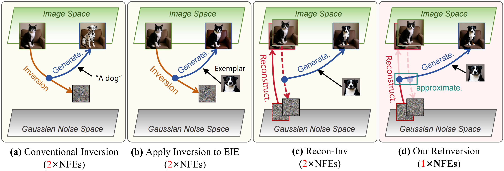

## Reversible Inversion for Training-Free Exemplar-guided Image Editing

<p align="center">
<a href='https://liyuke65535.github.io/' target='_blank'>Yuke Li</a><sup>1</sup>,
<a href='https://lianligao.github.io/' target='_blank'>Lianli Gao</a><sup>1</sup>,
<a href='https://jimzai.github.io/' target='_blank'>Ji Zhang</a><sup>1</sup>,
<a href='https://ppengzeng.github.io/' target='_blank'>Pengpeng Zeng</a><sup>2</sup>, <br>
<a href='https://lichuanx.github.io/cv/' target='_blank'>Lichuan Xiang</a><sup>3</sup>,
<a href='https://hongkaiw.github.io/' target='_blank'>Hongkai Wen</a><sup>3</sup>,
<a href='https://scholar.google.com/citations?user=krryaDkAAAAJ&hl=en' target='_blank'>Heng Tao Shen</a><sup>2</sup>,
<a href='https://scholar.google.com/citations?user=F5Zy9V4AAAAJ&hl=en&oi=ao' target='_blank'>Jingkuan Song</a><sup>2</sup>
</p>

<p align="center">
<sup>1</sup>University of Electronic Science and Technology of China, <sup>2</sup>Tongji University, <sup>3</sup>University of Warwick.<br>
<!-- † Corresponding author <br> -->
<!-- <span style="font-size: 1.5em;"><strong style="color:#0ea5e9;">ICCV 2025</strong> <strong style="color:#e91e63;">Highlight</strong></span>
</p> -->

<a href="https://arxiv.org/pdf/2512.01382"></a>


### Abstract



Exemplar-guided Image Editing (EIE) aims to modify a source image according to a visual reference.
Existing approaches often require large-scale pre-training to learn relationships between the source and reference images, incurring high computational costs.
As a training-free alternative, inversion techniques can be used to map the source image into a latent space for manipulation. However, our empirical study reveals that standard inversion is sub-optimal for EIE, leading to poor quality and inefficiency.
To tackle this challenge, we introduce **Reversible Inversion (ReInversion)** for effective and efficient EIE.
Specifically, ReInversion operates as a two-stage denoising process, which is first conditioned on the source image and subsequently on the reference. 
Besides, we introduce a Mask-Guided Selective Denoising (MSD) strategy to constrain edits to target regions, preserving the structural consistency of the background.
Both qualitative and quantitative comparisons demonstrate that our ReInversion method achieves state-of-the-art EIE performance with the lowest computational overhead.

### Pseudo Code
Our method is quite straight-forward and effective, here is a pseudo code version of it:
```
Inputs: X_src, X_ref, Mask, t_tau, eta

X = torch.randn_like(X_src)

for t in (timesteps):
    if t < t_tau: # stage 1
        v_theta = model(X, t, X_src) # conditioned on source image

    # update X
        X = X + v_theta * delta_t
    else: # stage 2
        v_theta = model(X, t, X_ref) # conditioned on reference image
        v = (X_src - X) / (1 - t) # deterministic velocity

    # update X (MSD)
        X[Mask==0] += (v[Mask==0] * eta + v_theta[Mask==0] * (1 - eta)) * delta_t # background
        X[Mask==1] += v_theta[Mask==1] * delta_t # foreground
return X
```

See more details in our <a href='https://arxiv.org/pdf/2512.01382'>paper</a>.


### COCOEE Test Bench
To test on COCOEE from our model, you can use `ReInversion_test_bench.py`. But you should download the benchmark from "Paint-by-Example".

For example, 
```
CUDA_VISIBLE_DEVICES=1 \
python ReInversion_test_bench.py \
--npy_pth test_bench/id_list.npy \
--gt_dir test_bench/GT_3500 \
--ref_dir test_bench/Ref_3500 \
--mask_dir test_bench/Mask_bbox_3500 \
--res_dir results/ReInversion
```


Or simply run:
```
sh run_test_bench.sh
```


### Individual Cases
Also, you can try examples in `demo.ipynb` or try your own cases. 

If ipynb is not suitable for you, try `python ReInversion_demo.py`.

